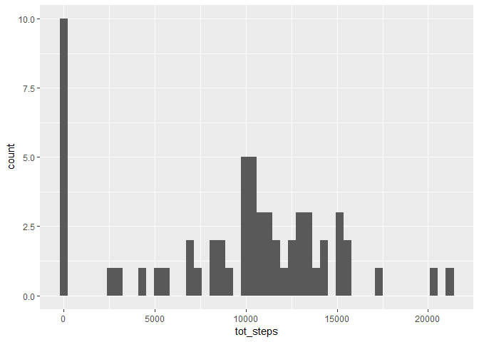
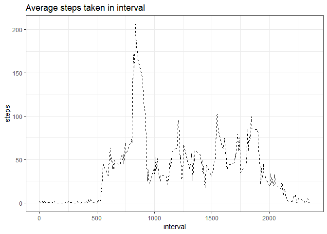
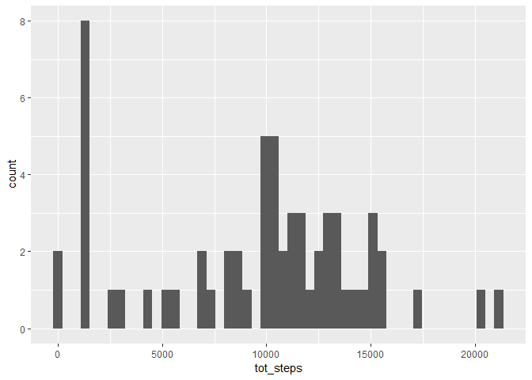
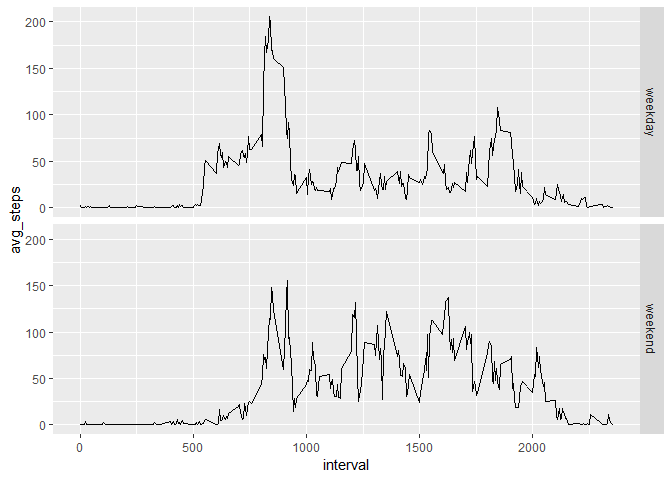

## Loading and preprocessing the data

```r
library(tidyverse)
library(lubridate)
data=read.csv("activity.csv",stringsAsFactors = F)
```


## What is mean total number of steps taken per day?

```r
data%>%
    group_by(date)%>%
    summarise(tot_steps=sum(steps,na.rm = T))%>%
    ggplot()+geom_histogram(aes(x=tot_steps),bins=50 )
```

<!-- -->

```r
mn=data%>%
    na.omit()%>%
    mutate(date=ymd(date))%>%
    group_by(date)%>%
    summarise(steps=sum(steps))%>%
    summarise(mean=mean(steps),median=median(steps))
```

The mean is 1.0766189\times 10^{4} and medain is 10765.

## What is the average daily activity pattern?

```r
data%>%
    na.omit()%>%
    group_by(interval)%>%
    summarise(avg_steps=mean(steps))%>%
    ggplot()+geom_line(aes(interval,avg_steps),linetype=2)+
    ggtitle("Average steps taken in interval")+
    ylab("steps")+
    theme_bw()
```

<!-- -->


## Imputing missing values

```r
empty=sapply(data,function(x){
    sum(is.na(x))
})
mdn=data%>%
    group_by(interval)%>%
    summarise(mn=median(steps,na.rm = T))
data_imp=data
na_pos=which(is.na(data_imp$steps))

for(i in na_pos){
    d_int=data_imp$interval[i]
    val=mdn[mdn$interval==d_int,"mn"]
    data_imp[i,1]=val
}
data_imp%>%
    group_by(date)%>%
    summarise(tot_steps=sum(steps,na.rm = T))%>%
    ggplot()+geom_histogram(aes(x=tot_steps),bins=50 ) 
```

<!-- -->

```r
mn_imp=data_imp%>%
    na.omit()%>%
    mutate(date=ymd(date))%>%
    group_by(date)%>%
    summarise(steps=sum(steps))%>%
    summarise(mean=mean(steps),median=median(steps))
```

There are 2304 NA's in the dataset. These need to be filled with median of the steps for the 5 min interval.

After imputing the mean is 9503.8688525 and median is 10395.

## Are there differences in activity patterns between weekdays and weekends?

```r
data_imp%>%
    mutate(date=ymd(date),day=weekdays(date),week=day %in% weekdays(as.Date("2019-04-27")+0:1))%>%
    mutate(week=factor(week,labels = c("weekday","weekend")))%>%
    group_by(interval,week)%>%
    summarise(avg_steps=mean(steps))%>%
    ggplot()+geom_line(aes(x=interval,y=avg_steps))+
        facet_grid(week~.)
```

<!-- -->
